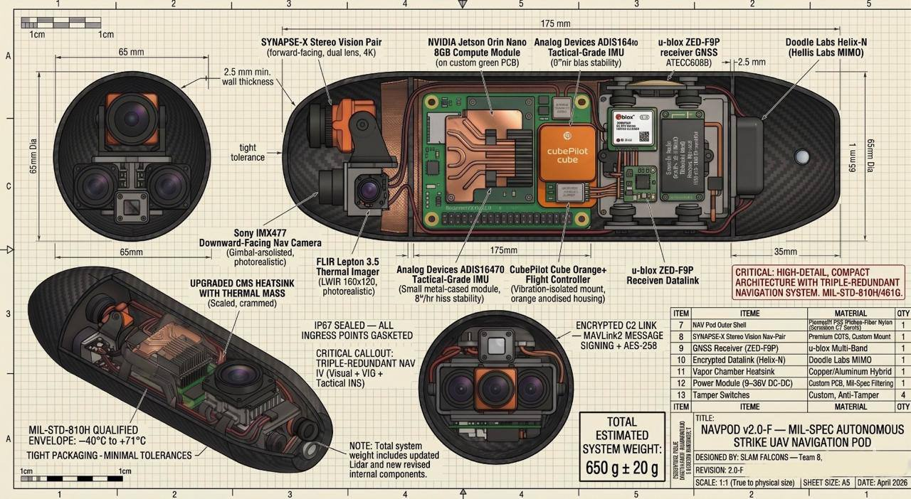

# NavPod — GPS-Denied Autonomous BWB Strike UAV
**Platform:** Blended Wing Body (BWB) Fixed-Wing UAV | **Event:** Defensathon 2026 — UAV Track

> "Not a concept. Not a slide deck. A fully working technical simulation grounded in 
> real hardware, aerodynamics, and AI architecture."

---

## The Problem
Every precision-strike platform in service today depends on GPS. Modern EW systems 
(like the Krasukha-4) can deny GPS across 200km in under 90 seconds. When that 
happens, the kill-chain collapses. NavPod's answer isn't GPS-resistant — it's GPS-independent.

---

## Architecture

### Outer Loop — AI Mission Processing (Jetson Orin Nano, 40 TOPS)
- ORB-SLAM3: 6-DoF terrain mapping, no GPS
- YOLOv8-n: 60fps INT8 target classification
- Sends exactly 4 numbers to inner loop: Δheading, Δpitch, Δroll, Vref

### Inner Loop — Flight Stabilization (Pixhawk Cube Orange+ / ArduPilot)
- 400Hz EKF3, triple IMU redundancy
- BWB elevon mixer: δL = (Pitch+Roll)/2, δR = (Pitch−Roll)/2
- Failure containment: If AI dies, ArduPilot holds wings-level and RTBs

### Bridge
- MAVLink via UART, 921,600 baud
- Cryptographically signable

---

## Simulations Built (7 Variants)

| Variant | Description |
|---------|-------------|
| BWB Kinetic Strike | Main sim — full EW jamming dome, autonomous hunt, terminal dive |
| Canyon Strike | Terrain-following nap-of-earth variant to defeat radar detection |
| SLAM Mapping | Quadcopter swarm for building 3D point-cloud maps of contested terrain |
| CONOPS & Architecture | Full operational doctrine and animated mission-synced block diagram |

---

## AI Detection Logic
Detection is geometry, not timers. NavPod confirms a lock only when the target is 
physically inside the camera frustum for 1,200ms of continuous sighting. Search uses 
an ICAO-standard creeping-line lawnmower pattern with guaranteed sensor swath overlap 
to protect the SLAM feature baseline.

---

## The Breakthrough
Uploaded an actual satellite image of a real military compound. The simulation rebuilt 
the entire 3D target from the photo — curved assembly hall, warehouses, command 
building, and helipad. NavPod hunts that exact compound. It doesn't work on a 
fictional map. It works on the real world.

---
## Hardware Architecture



🔴 **[Live Simulation Demo](https://isalehalsubaie-hash.github.io/navpod-project/)**

## Tech Stack
- ROS2 | ArduPilot | ORB-SLAM3 | YOLOv8 | MAVLink
- Jetson Orin Nano | Pixhawk Cube Orange+
- MATLAB/Simulink | WebGL Simulation
- EKF3 | State Space Control | Proportional Navigation

---

## Status
🔴 Active development — Defensathon 2026

---

## What's Next

### Terrain Navigation (TNav)
GPS-aided positioning gets replaced with a full TNav pipeline. Pre-load a georeferenced 3D terrain map before launch, then match live nadir camera frames against it mid-flight to get a corrected position fix without any GPS signal. Evaluating ArcGIS for map prep, ORB-SLAM3 is already in the stack.

### AI-Aided INS
EKF3 alone drifts. The plan is to add an AI-aided INS block that predicts and corrects gyro drift (~5°/h) so we can hold 80%+ position accuracy across a full GPS-denied ingress. TNav corrections feed back in to bound the error growth between terrain fixes.

### Three-Stage Nav Modes
```
[INav] ──(IMU + Baro)──► [INS] ──► Position Output
                           ▲
                        [GPS] (available) / [TNav] (GPS-denied)
```
Stage 1: normal INS + GPS. Stage 2 (silence mode): terrain matching via nadir camera only. Stage 3 (full silence): LiDAR added for dense point-cloud features when terrain is low-texture or dusty.

### LiDAR Layer
Camera-only TNav degrades in featureless terrain. Adding a LiDAR alongside the nadir cam gives a dense 3D point cloud to pull features from — more robust fix, longer GPS-denied range.

### HIL Sim in Unity
Moving beyond WebGL to a proper hardware-in-the-loop setup:
```
Ground Station ──► PX4 SITL ◄──── GPS sim
                      │
                  Unity Sim ◄── CAD model
                      │ UDP
                  AI Model ──► Position Output
```
Same PX4 firmware as the real hardware. Target is 85% sim-to-real fidelity before any physical flight test. DRI block bridges the gap between terrain fixes.
